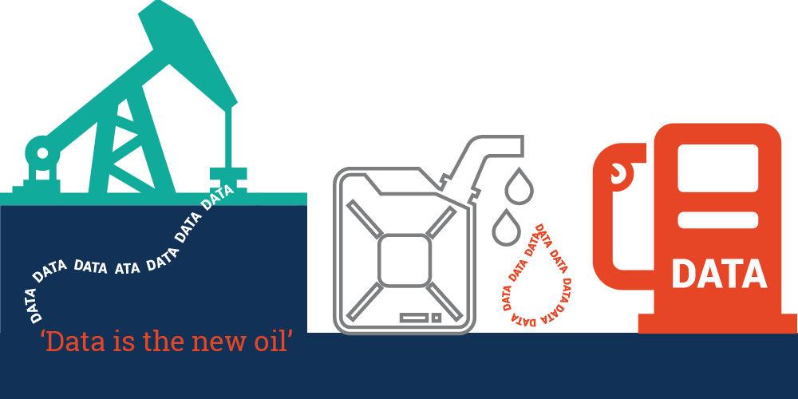
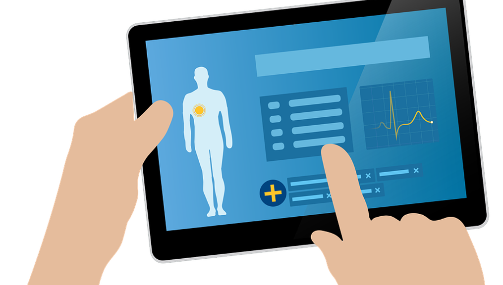
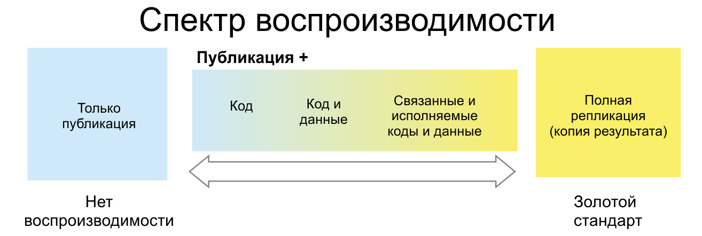
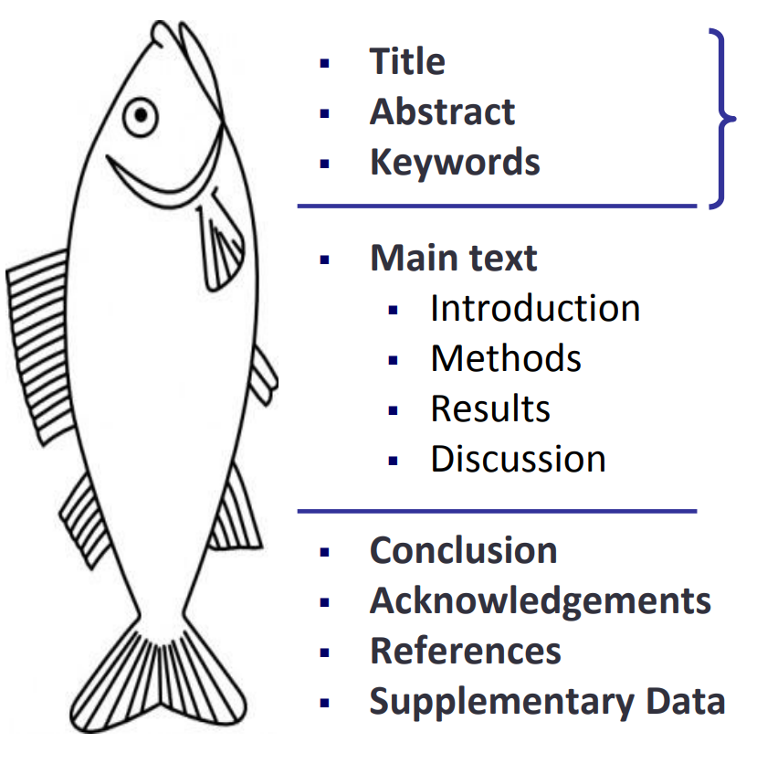
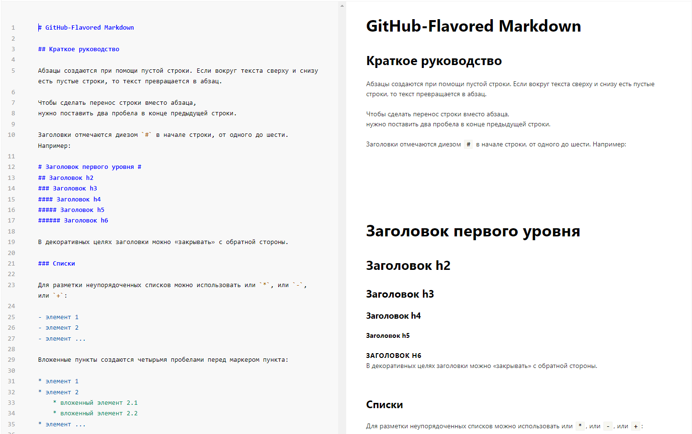
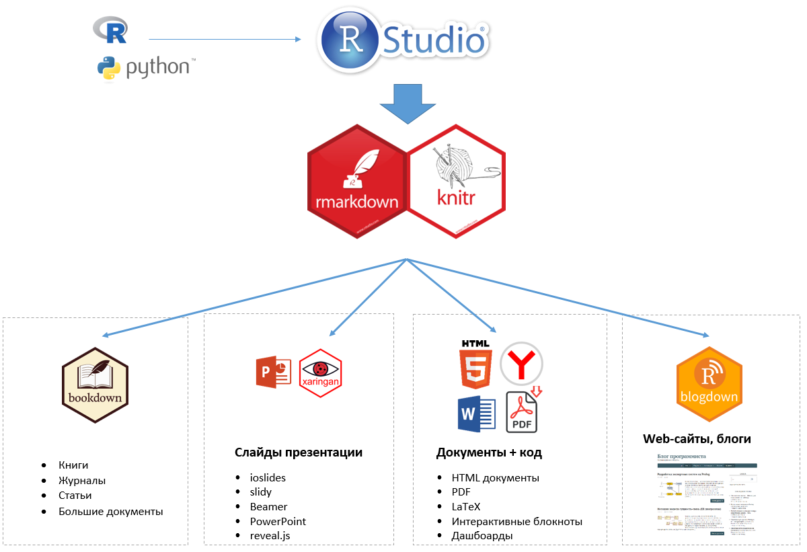
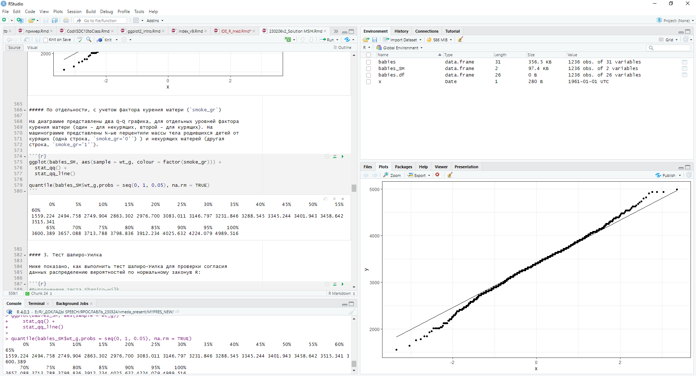
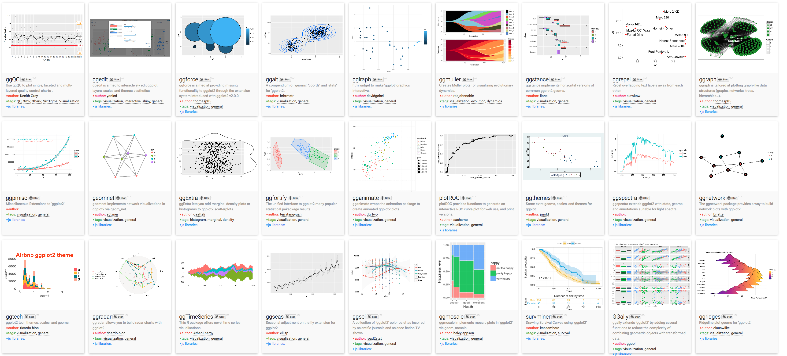

```{r setup, include=FALSE}
# author: "Корнеенков Алексей Александрович<br>alkorneenkov@yandex.ru"
# wants <- c("knitr", 
#           "tidyverse",
#           "devtools",
#           "xaringan",
#           "xaringanExtra", 
#           "devtools",
#           "fontawesome")
# has   <- wants %in% rownames(installed.packages())
# if(any(!has)) install.packages(wants[!has])

# install.packages("devtools") # для icons
## library(devtools) # install_github()
## install_github("mitchelloharawild/icons")

# Для скачивания библиотеки инонок: download_fontawesome(version = "dev")
# download_fontawesome(version = "dev") 
# download_bioicons()


#------------Для преобразования в pdf

# remotes::install_github("jhelvy/renderthis@v0.0.9")
# library(renderthis)
# renderthis::to_pdf("IDE_R_vmeda.Rmd")

library(knitr)
library(devtools)
library(tidyverse)
library(xaringan)
library(xaringanExtra)
library(icons)
library(fontawesome)


knitr::opts_chunk$set(fig.width=4.25, fig.height=3.5, fig.retina=3,
                      message=FALSE, warning=FALSE, cache = TRUE, 
                      autodep = TRUE, hiline=TRUE)
knitr::opts_hooks$set(fig.callout = function(options) {
  if (options$fig.callout) {
    options$echo <- FALSE
    options$out.height <- "99%"
    options$fig.width <- 16
    options$fig.height <- 8
  }
  options
})
hook_source <- knitr::knit_hooks$get('source')
knitr::knit_hooks$set(source = function(x, options) {
  if (!is.null(options$hiline) && options$hiline) {
    x <- stringr::str_replace(x, "^ ?(.+)\\s?#<<", "*\\1")
  }
  hook_source(x, options)
})
options(htmltools.dir.version = FALSE, width = 90)
as_table <- function(...) knitr::kable(..., format='html', digits = 3)
```

```{r xaringanExtra, echo=FALSE, message=FALSE, warning=FALSE, include=FALSE}
# Добавляем возможнность просмотра всех слайдов, полосы навигации, рисования на слайдах
# fit_screen -  расширение добавляет сочетание клавиш — Alt/Option +"F" — которое подгоняет слайды под размер экрана и игнорирует соотношение слайдов. (В настоящее время он только включается; перезагрузите слайды, чтобы вернуться в нормальное состояние.)
library(xaringanExtra)

xaringanExtra::use_xaringan_extra(c("tile_view", 
                                    "share_again",
                                    "webcam",
                                    "fit_screen",
                                    "broadcast",
                                    "scribble"#, 
                                    #"slide_tone"
                                    ))
```

```{r components, include=FALSE}
# Создание слайдов из набора изображений, собранных в определенной папке 
slides_from_images <- function(
  path,
  regexp = NULL,
  class = "hide-count",
  background_size = "contain",
  background_position = "top left"
) {
  if (isTRUE(getOption("slide_image_placeholder", FALSE))) {
    return(glue::glue("Slides to be generated from [{path}]({path})"))
  }
  if (fs::is_dir(path)) {
    imgs <- fs::dir_ls(path, regexp = regexp, type = "file", recurse = FALSE)
  } else if (all(fs::is_file(path) && fs::file_exists(path))) {
    imgs <- path
  } else {
    stop("path must be a directory or a vector of images")
  }
  imgs <- fs::path_rel(imgs, ".")
  breaks <- rep("\n---\n", length(imgs))
  breaks[length(breaks)] <- ""

  txt <- glue::glue("
  class: {class}
  background-image: url('{imgs}')
  background-size: {background_size}
  background-position: {background_position}
  {breaks}
  ")

  paste(txt, sep = "", collapse = "")
}
options("slide_image_placeholder" = FALSE)
```

class: fullscreen, inverse, top, center, text-white
background-image: url("images/vmeda_winter.jpg")

.font150[**Санкт-Петербург**]

---

name: rpresentations
layout: false
class: center middle inverse no-scribble

.center[ `r icons::icon_style(icons::fontawesome("heartbeat"), scale = 2, fill = "#E8EDEE")`]
<br><br>
# Цифровое здоровье (Digital Health): 
## "цифро-здоровье", "цифро-здравоохранение", "цифро-медицина"

.absolute.bottom-1.left-3[[.white[пропустить]](#resources)]

???
Цифровой, цифровые, цифровизация - эти слова сейчас используются буквально повсюду. Что же делать, чтобы быть современными и готовыми к будущему?
Распространение и технологические развитие мобильных устройств и появление повсеместного доступа к Интернету коренным образом изменило общество и его здравоохранение.
В сочетании с проблемами быстрого технического прогресса мы также сталкиваемся со сменой поколений учащихся.
Поколение миллениалов ушло в прошлое, и Z поколение (те, кто родился после 1997 года)  поступили в высшие учебные заведения. Это, так называемые «цифровые аборигены» (Digital Natives), т.е. люди, родившимиеся после цифровой революции и привыкшие получать информацию (практические исключительно) через цифровые каналы.

Хотя эти технологии окружают их с рождения, совсем не обязательно, что они хорошо разбираются в том, как применять цифровые технологии - есть существенная разница между знакомством и творческим применением этих тезнологий.
Ожидание того, что это поколение само по себе хорошо предвидит использование цифровых технологий при оказании медицинской помощи, может быть завышенным. 
Можно не останавливаться на концепциях цифровой стратификации поколений, цифровых аборигенах", "иммигрантах" и т.п., но наличие цифрового разрыва между поколениями, особенно в медицине существенно "утяжеляет" медицинский образовательный процесс. Особенно, когда возраст преподавателей далеко за ожидаемую продолжительность жизни.
Принимая это во внимание, медицинские науки сталкиваются с дилеммой, как лучше решить вопросы интеграции цифрового здоровья, здравоохранения (вообще, как такового) в свои образовательные программы.  
---
layout: true
# "Цифровой бум" в медицине
---

.left-column[

.center[__Поколение Z__]
]

.right-column[.font120[
Тема .hl[**цифрового здоровья**] (*Digital health*) сейчас привлекает всеобщее внимание, благодаря новым технологиям и цифровым устройствам, доступным массовому пользователю. 

Эту тему активно развивают как медицинские организации, ориентирующиеся на новые технологии, так и компании, ранее не интересовавшиеся цифровым здоровьем и здравоохранением (например, **Сбер**, **Яндекс**, **Apple**, **Google**).
]

]

???
**Цифровое здоровье** (иногда, цифровое здравоохранение) (Digital Health) - технологии, связанные со здоровьем, здравоохранением, жизнью и обществом, нацеленные на то, чтобы повысить эффективность оказания медицинской помощи и сделать медицину более персонализированной и точной
---

### Цифровизация здравоохранения усугубляет перегрузку врачей медицинскими данными.

Вопрос: .hl[Как использовать эти данные]? Что с ними делать дальше? 

- Какие медицинские данные возможно собирать? 
- Как они способствуют пониманию болезни и приводят к осознанным действиям. 
- Как обучать студентов, при пробелах в знаниях по оказанию медпомощи в будущем. 
- Пациенты могут сами получать данные о своем здоровье, которые врачи не в состоянии понять. Что делать?

.img-bottom[]

???

Сейчас накоплено огромное количество асинхронно собранных медицинских данных, которые мы пытаемся использовать для машинного обучения, глубокого анализа.
Но появляются непрерывные данные, современные, собираемые синхроннно с жизнью человека. Незнание врачом того, как ориентироваться в этом новом наборе данных, вызывает тревогу. Например, за пределами лечебного учреждения медики не обучены работе с непрерывными клиническими данными. Это станет проблемой с увеличением передачи данных в режиме реального времени от пациентов, решивших использовать носимые устройства и приложения, которые будут передавать данные по мере их сбора.

Поскольку многие отслеживают, **как их клиенты, потребители используют свои смартфоны** (например, история поиска), их **геолокацию** и привычные **передвижения**, а также мысли и **отношения** (например, из социальных сетей), неудивительно, что компании и организации ищут в этих данных аспекты, относящиеся к здоровью. 
Можно рассмотреть несколько важных аспектов: например, контроль приверженности лечения.
Новые технологии, такие как терапия с виртуальным наблюдением (VOT), биосъемные датчики, и даже умные флаконы и коробки для таблеток предлагают более объективные данные о привычках пациентов к самостоятельному приему лекарств. В прошлом клиницисты могли быть «в неведении» относительно того, принимает ли пациент их лекарства. Благодаря современным технологиям мы теперь можем это знать. 

---

layout: false
class: center middle inverse no-scribble 

.center[ `r icons::icon_style(icons::fontawesome("list-alt"), scale = 2, fill = "#E8EDEE")`]
<br><br>
# Медицинская аксиома – не назначайте тест, если вы не готовы иметь дело с его результатами. 
.hl[Зачем] собираете данные, если не знаете, что с ними делать?  

---
layout: false
# Что делать с "новыми" медицинскими данным?

.left-column[

.center[__Направления__]
]

.right-column[.font75[
- **Передовые методы анализа данных**. 
> Должны ли врачи иметь базовое понимание анализа медицинских данных?

- **Цифровые медицинские продукты** (приложения) 
> Это - программное обеспечение предназначено для диагностики, контроля над состоянием и лечением пациентов.

- **Цифровые устройства** как источники данных о здоровье
> Цифровые медицинские технологии не включены в традиционные клинические руководства или официально не учитываются при обучении. 

]
.footnote[]
]


???
1) Перед клиницистами будущего стоит загадка, что делать с новыми данными.
Нынешние практикующие врачи и педагоги, по-видимому, не понимают этой проблемы. 
Много говорится об использовании «искусственного интеллекта» (ИИ) в большей части разрабатываемого программного обеспечения. Можно спорить о том, можно ли назвать эти современные технологии настоящим «ИИ», но машинное обучение и связанные с ним темы действительно проникают в здравоохранение. Как будущие практикующие врачи должны относиться к предположениям или анализам, генерируемым ИИ? Должны ли будущие клиницисты иметь базовое понимание анализа медицинских данных которые в настоящее время не приняты в большинстве учреждений.

2) Цифровая терапия быстро определяется как новое средство оказания помощи пациентам. Это программное обеспечение, основанное на фактических данных, часто поставляемое в виде приложений на мобильное устройство, предназначено для управления и лечения заболеваний пациентов. 
Это выходит за рамки простого назначения лекарств. Для стандартной клинической фармакологии и терапии, студенты часами разбираются в лежащей в основе лекарственных препаратов фармакологии и фармакокинетике их активных ингредиентов в организме, основываясь на  понимании анатомии и физиологии человека. Как поступать с цифровыми назначениями?
Скорее, мы видим, что **концепция программного обеспечения, внутреннюю работу которого большинство студентов не могут понять без образования в области компьютерных наук, прописывается для оказания медицинской помощи**. 

Цифровые медицинские технологии, доступные пациентам, опережают интеграцию этих технологий в клиническую практику. Сенсоры быстро перемещаются в область повседневно носимых устройств. Умные часы могут измерять данные электрокардиограммы и сообщать, если у пациента наблюдается фибрилляция предсердий, что должно быть подтверждено врачом. Данные, имеющие значение для медицинской практики, такие как характер сна или ежедневных физических упражнений, до сих пор не включены в традиционные клинические руководства или официально не учитываются при обучении медицинской помощи. Это отсутствие интеграции на практике не удерживает наших нынешних пациентов от использования этих устройств. Насколько глубоко готовить наших врачей по этим вопросам?

---

layout: false
class: center middle inverse no-scribble 

.center[ `r icons::icon_style(icons::fontawesome("graduation-cap"), scale = 2, fill = "#E8EDEE")`]
<br><br>
# Цифровое здоровье в медицинском <br>(военно-медицинском) образовании  

--
----
.center[Чему обучать студентов (курсантов), чтобы они были готовыми к работе в  цифровом здравоохранении?]

---
layout: true

# Цифровое здоровье в медицинском образовании  
---

### Рейтинг тем (по убыванию) по мнению экспертов, которые необходимо отражать в учебных программах вузов при изучении цифрового здравоохранения.

--

.font70[
- Медицинские данные (например, типы систем электронных медицинских карт, биобанки, реестры пациентов, обмен и хранение информации)
- Понимание плюсов и минусов телездравоохранения
- Применение биомедицинских датчиков
- Основы терминологии цифрового здравоохранения
- Цифровая грамотность в вопросах здоровья (обращение с информацией о здоровье из электронных источников)
- Мониторинг пациентов в режиме реального времени
- Преимущества и ограничения систем поддержки принятия клинических решений
- Основные концепции искусственного интеллекта (ИИ) для здравоохранения
- Клинические применения биоинформатики
- ... **до 22 тем**
]

--

При такой объеме требуемых "инженерных" знаний, надо готовить врачей-инженеров, врачей программистов?

???
Медицинское сообщество уже проводило исследование возможной тематики оптимальных учебных программ по цифровому здравоохранению. 
В целом тематика приобретает все более четкие контуры: это темы вокруг как создания нового цифрового медицинского проекта (приложения), так и традиционной цели по передаче ЭВМ всех функций, которые она выполняют лучше человека. 
Возможно ли обьединие, интеграция этих тем в одном месте, в единой среде? И статистический анализ, и симуляция медицинской среды и данных, и разработка приложений? Каким технологим следует отдать приоритет?

Это хороший вопрос. Есть проблемы.

1) Ожидается, что технологии будут экспоненциально расширять свое применение в здравоохранении, и это возлагает на преподавателей ответственность за то, чтобы быть в курсе текущих тенденций в области цифровых инноваций. Хотя сам «футуризм» не является обязанностью педагога, разумно ожидать, что необходимо принять и понять ландшафтные движения.

2) Проблема - Жизненный цикл развития этих технологий и их неоднозначная роль в клинической эффективности затрудняют установление стандартов образования в области цифрового здравоохранения. Для будущих и нынешних клиницистов следует делать акцент на базовых навыках оценки соответствия этих технологий контекстуальному клиническому использованию. Например, врачу не нужно знать все приложения для напоминаний о приеме лекарств, доступные для мобильных телефонов. Однако они должны быть в состоянии оценить индивидуальные потребности пациентов, такие как история диагноза и цифровая грамотность, чтобы дать пациентам значимые и действенные рекомендации. Эти базовые навыки дополняют и расширяют существующие клинические навыки в образовательных стандартах.

Куда двигаться? Обучать врачей программирвоанию?
---

layout: false
class: center middle inverse no-scribble 

> .font120[Давайте изменим наше традиционное отношение к построению программ: вместо того, чтобы воображать, что наша главная задача — инструктировать компьютер, что делать, лучше сосредоточимся на объяснении людям того, что мы хотим, чтобы компьютер делал.]
<br>

.right[__Donald E. Knuth, Literate Programming, 1984__]

???
Учебные программы 

Инновационные учебные программы медицинского образования могут быть разработаны в соответствии со следующими принципами:
•	Интерактивность (Interactivity). Активное обучение подразумевает переход от класса (группы учащихся, аудитории), ориентированного на учителя, к подходу, ориентированному на ученика, который повысит любознательность, повысит вовлеченность и приведет к лучшему обучению и пониманию. Образовательные технологии должны способствовать интерактивности во всех учебных заведениях.
•	Двунаправленность (Bidirectionality). Учащимся должно быть разрешено применять свои знания для решения сложных задач в условиях, способствующих сотрудничеству со сверстниками и постоянной двусторонней обратной связи между преподавателями и учащимися и между сверстниками.
•	Смешанность (Blendedness). Новые технологии должны быть интегрированы с традиционными методами. Онлайн-лекции, онлайн-игры должны интегрировать традиционные лекции, обучение у постели больного и групповые симуляции в комплексной учебной программе.
•	Транснациональность (Transnationality). Поскольку веб-платформы допускают международное сотрудничество, учебные программы по медицине должны быть транснациональными и способствовать вкладу различных университетов. Это позволило бы обеспечить однородность обучения в европейских странах. Это также улучшит понимание культурного разнообразия.
•	Актуальность (Up-to-dateness). Возможность записывать и транслировать лекции, которые учащиеся могут посещать из своего дома в выбранное ими время, не должна способствовать повторному использованию материалов из года в год. Материалы должны тщательно проверяться на актуальность и постоянно обновляться.

Акценты:
- Экспоненциальный рост и расширение применения технологий требует от педагога понимания изменения "ландшафта" в этой области.Новые технологии будут продолжать появляться и исчезать в практическом здравоохранении. 

- Короткий жизненный цикл развития этих технологий и их неоднозначная роль в клинической эффективности затрудняют установление стандартов образования в области цифрового здравоохранения. 

 - Для будущих и нынешних клиницистов следует делать акцент на базовых навыках оценки соответствия этих технологий контекстуальному клиническому применению. Так же, как учащиеся узнают о разработке лекарств с участием химиков, статистиков и юристов, учащиеся должны иметь широкое, но функциональное понимание классификации медицинских устройств применительно к цифровому здравоохранению. 


---
layout: false

name: IDE
class: inverse, middle, center

---
template: IDE

.center[ `r icons::icon_style(icons::fontawesome("sitemap"), scale = 2, fill = "#E8EDEE")`]
<br><br>

# Интегрированная среда разработки <br>(учебных, научных) проектов

--

----
<br>
.left-col[.center[
`r icons::icon_style(icons::fontawesome("r-project"), scale = 2, fill = "#E8EDEE")`

.center[Какими программными средствами?]
]]

--

.center-col[
.center[
`r icons::icon_style(icons::fontawesome("hospital"), scale = 2, , fill = "#E8EDEE")`

.center[Какие решаются задачи<br>предметной области?]
]]

--

.right-col[.center[
`r icons::icon_style(icons::fontawesome("network-wired"), scale = 2, fill = "#E8EDEE")`

.center[С помощью какого<br>технического обеспечения?]
]]

---
layout: false
class: center middle inverse no-scribble 

## Воспроизводимость результатов практических заданий, научных работ, исследований

[Peng RD. Reproducible research in computational science. Science. 2011 Dec 2;334(6060):1226-7. doi: 10.1126/science.1213847. PMID: 22144613; PMCID: PMC3383002.](https://www.ncbi.nlm.nih.gov/pmc/articles/PMC3383002/)

???
Peng, R. D. (2011). Reproducible Research in Computational Science. Science, 334(6060), 1226–1227. doi:10.1126/science.1213847 

---
layout: true
# Задача: обеспечение воспроизводимости исследований
---

`r slides_from_images("chart_reprod", )`

---
layout: false
# Задача: обеспечение воспроизводимости исследований

.center[]

???
Мы сосредоточимся на одном из инструментов, позволяющих и расширяющих возможности воспроизводимого выполнения анализа.

Когда вы выполняете лабораторную работу, вы используете лабораторные записи в тетрадях, чтобы систематизировать свои методы, результаты и выводы для будущего поиска и воспроизведения. 
Информация в этих записях преобразуется в более краткое экспериментальное описание для раздела «Методы» при публикации результатов. Вычислительный анализ требует такого же усердия! Эквивалентом лабораторной тетради для вычислительной работы является подробный журнал работы, инструменты на каждом этапе, параметры этих инструментов и, что не менее важно, версии инструментов.
---

# Стандарт представления резульатов исследования

.left-column[

__IMRAD__
]
.right-column[
Части **IMRAD** отвечают на вопросы: 

- .hl[**I**] Почему начали исследование?
- .hl[**M**] Почему исследователи так сделали?
-	.hl[**R**] Что обнаружили в результате исследования?
- .hl[**D**] Что означает результат?

.font70[
.hl[IMRAD] (/ˈɪmræd/) является аббревиатурой от «введение, методы, результаты и обсуждение» (англ. introduction, materials and methods, results and discussion) — структура научной статьи оригинального исследовательского типа, содержащей, как правило, эмпирическое исследование.
Первой научной работой, имеющую структуру, подобную IMRAD, считается «Études sur la bière» Луи Пастера, написанная в 1876 году. В 1970-х годах IMRAD стал «стандартом» в оформлении научных статей, когда в 1972 году и затем в 1979 году был опубликован стандарт ANSI Z39.16-1972 (Preparation of Scientific Papers for Written or Oral Presentation).
]
]

---
layout: true

# Программная среда: R, Python, Markdown

---

### Что подходит именно вам?
Выбор правильного языка зависит от ситуации. Вот некоторые вопросы, которые следует учитывать:


- **Чем пользуются ваши коллеги?**

- **Есть ли у вас опыт программирования?** 

- **Какие проблемы вы пытаетесь решить?**

- **Насколько важны диаграммы и графики?** 

???

*У вас есть опыт программирования?* Благодаря простому для чтения синтаксису, у Python есть линейная и плавная кривая обучения. Считается хорошим языком для начинающих программистов. С R новички могут выполнять задачи анализа данных за считанные минуты. Но сложность расширенной функциональности в R затрудняет накопление опыта.
*Чем пользуются ваши коллеги?* R — это статистический инструмент, используемый академиками, инженерами и учеными без каких-либо навыков программирования. Python — это готовый к производству язык, используемый в широком спектре промышленных, исследовательских и инженерных рабочих процессов.
*Какие проблемы вы пытаетесь решить?* Программирование на R лучше подходит для обучения статистике благодаря непревзойденным библиотекам для исследования данных и экспериментов. Python — лучший выбор для машинного обучения и крупномасштабных приложений, особенно для анализа данных в веб-приложениях.
*Насколько важны диаграммы и графики?* Приложения R идеально подходят для визуализации ваших данных в красивой графике. Напротив, приложения Python легче интегрировать в инженерную среду.
Обратите внимание, что многие инструменты, такие как Microsoft Machine Learning Server, поддерживают как R, так и Python. 

---
 — это язык программирования и программная среда для статистической обработки данных и их визуализации, которая **позволяет**:

-  Создавать воспроизводимые R-скрипты;
-  Проводить экспорт/импорт различных данных в R среде;
-  Использовать функции R для глубокого анализа данных;
-  Устанавливать дополнительные пакеты, расширяющие базовые возможности в R;
-  Вычислять описательные статистики, проверять гипотезы, оценивать связи и т.д.;
-  Выполнять математические расчеты,
-  Визуализировать результаты вычислений, создавать диаграммы различного вида и уровня сложности.

---
.pull-left[
.center[`r icons::icon_style(icons::fontawesome("python"), scale = 2, fill = "steelblue")`]<br>
.font90[
- **Python** предлагает более общий подход к обработке данных.
- **Python** — это многоцелевой язык, очень похожий на C++ и Java, с удобочитаемым синтаксисом, который легко освоить.
- Используется для анализа данных или машинного обучения в масштабируемых производственных средах.
...
]]
--
.pull-right[
.center[`r icons::icon_style(icons::fontawesome("r-project"), scale = 2, fill = "steelblue")`]<br>
.font90[
- **R** в основном используется для статистического анализа.
- **R** создан статистиками и опирается на специализированную аналитику. 
- Исследователи данных используют **R** для глубокого статистического анализа, поддерживаемого всего несколькими строками кода и прекрасной визуализацией данных. 
...
]]
--

### Большинство организаций используют комбинацию обоих языков, и дебаты по выбору между R и Python совершенно напрасны.

???
Оба языка программирования с открытым исходным кодом поддерживаются большими сообществами, которые постоянно расширяют свои библиотеки и инструменты. Основное различие между двумя языками заключается в их подходе к науке о данных.
---

layout:false
class: fullscreen, top, center
.font120[**Markdown**]  — облегчённый язык разметки
.center[]

???
**Markdown** (МФА: [ˈmɑːkdaʊn], произносится маркда́ун) — облегчённый язык разметки, созданный с целью обозначения форматирования в простом тексте, с максимальным сохранением его читаемости человеком


---
# Интегрированная среда разработки ЦМП

.center[]


???
RMarkdown
Создать код «золотого стандарта» не всегда просто, в зависимости от того, какой язык программирования вы используете. Для анализа в R RStudio помогает упростить воспроизводимые исследования с использованием сценариев R, которые документируют весь код, используемый для выполнения определенного анализа. Однако мы часто не сохраняем версии инструментов, которые используем в скрипте, а также не включаем и не интерпретируем результаты анализа в скрипте.

RMarkdown — это формат файла в его самой базовой форме, который в конечном итоге может быть преобразован в общедоступный документ, например HTML, PDF и многие другие. Это позволяет вам документировать не только ваш код R (Python и SQL), но также позволяет включать таблицы, рисунки и описательный текст. В результате получается окончательный документ, содержащий методы, код и интерпретацию результатов в одном документе!

Чтобы уточнить, вы пишете файл, используя язык Markdown , и вставляете в него фрагменты исполняемого кода R. Фрагменты кода связаны с синтаксисом Knitr , так что после того, как ваш документ будет готов, вы можете легко преобразовать его в один из нескольких распространенных форматов (например, HTML, PDF, PPT) для совместного использования или документирования.

---
class: fullscreen, top, center
.font120[**RStudio**]
.center[]

---
layout: false
# RStudio - платформа изучения программирования

.pull-left[
#### .hl-gr[Преимущества]:
- наличие большого количества интегрируемых платформ (Bash, C++, Python, SQL, JavaScript);
- удобная модель представления с помощью RMarkdawn,Knit;
- отсутствие необходимости привыкания к новому интерфейсу при смене платформы.
]

--
.pull-right[
#### .hl[Недостатки]:
- проблемы при работе с дополнительными библиотеками не являющимися частью ядра языка программирования (не видит);
- проблемы с созданием готовых приложений с графическим интерфейсом (нет IDE для разработки визуального интерфейса, не компилирует файл в исполнимом виде).
]
---
class: fullscreen, top, center
.font150[Результаты статистического анализа в **ggplot2**]<br>
.center[]

---
class: center middle inverse no-scribble 

`r icons::icon_style(icons::fontawesome("pen"), scale = 2, fill = "#E8EDEE")`
<br>
<br>
<br>
# P. S.
---
class: left middle inverse no-scribble 

**Медицинская статистика** - это расчеты и числа,<br>
Которые помогают врачам - спасти наши жизни,<br>
Она помогает им лечить и предсказывать,<br>
И делать наши дни менее страшными и прекрасными.<br><br>

Это интеллектуальный подход к диагностике,<br>
Который позволяет предотвращать заболевания,<br>
Она помогает нашим докторам узнать о том,<br>
Как лечить и насколько быстро мы будем выздоравливать от болезней.<br><br>

---
class: left middle inverse no-scribble 

Медицинская статистика - это ключ к знаниям,<br>
Это понимание и уверенность,<br>
Она стремится спасти наши жизни,<br>
Дать нам возможность продолжать их жить дольше, более здоровыми.<br>
<br>

Благодарим медицинских статистиков за их профессионализм,<br>
За их умение обрабатывать данные и переводить в действия,<br>
Они работают вместе с врачами, чтобы спасти наши жизни,<br>
И помогать нам жить с более ясным видением здоровья и благополучия.<br><br>
--
<br>
.right[.font120[**ChatGPT**, стих о медицинской статистике. 😁]]

---
class: fullscreen, inverse, top, center, text-white
background-image: url("images/lahta_sunset_1.png")

.font150[**Спасибо за внимание!**]
